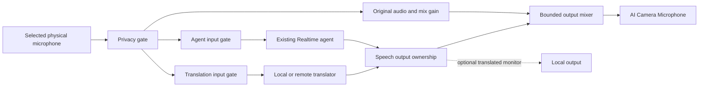

# Spoken translation during a call

This is the implementation design for the remaining spoken-output part of
[#57](https://github.com/kortexa-ai/aicamera/issues/57). Current translation tools produce captions.
The design below does not enable speech translation or change existing audio routes.

## The first useful experience

The user asks “Translate my voice into Spanish.” Their friend hears translated speech through
**AI Camera Microphone**, while the user continues speaking normally. Agent input can stay paused.
The translator handles speech; the agent controls its state and helps with other requests.

Start with one source—the selected physical microphone—and one outgoing spoken language. Incoming
participant audio, system audio, voice cloning, multiple simultaneous spoken languages, and remote
control of a calling app's mute button are separate features. Selecting AI Camera as the video
source alone does not route its microphone into the call.

| Control | Effect |
| --- | --- |
| Saved translation setup | Selects a provider, language, and available local voice where applicable |
| Voice translation on/off | Admits fresh source audio/text to that translator |
| Agent Pause listening | Closes agent input; explicitly enabled translation continues |
| Agent Stop / sleep | Ends the assistant session; independently enabled translation can continue |
| AI Camera privacy mute | Stops source/translated/agent audio and clears captions and pending work |
| Calling app's mute | Is outside AI Camera's current visibility; see #51 |

Do not infer addressed speech to decide whether translation is permitted. A user-closed gate is
authoritative. Turning translation on never unmutes AI Camera. Like captions, an enabled translator
can process conversation with the other person while agent input is paused; explain this near the
listening control. Voice translation starts off after app launch and requires explicit activation.

## Two implementations with different strengths

| Path | Useful property | Constraint |
| --- | --- | --- |
| Local Whisper → HY-MT → system speech | Reuses local models; no new remote audio egress | Segment-based latency, accumulated translation/synthesis delay, installed target-voice coverage |
| Dedicated OpenAI Realtime Translation | Continuous interpretation with speech and text output | Separate authenticated network session, supported target subset, network/cost and mixed-language behavior |

Apple provides [`AVSpeechSynthesizer.write(_:toBufferCallback:)`](https://developer.apple.com/documentation/avfaudio/avspeechsynthesizer/write%28_%3Atobuffercallback%3A%29)
to obtain synthesized audio buffers for processing. Use this buffer API, not an independent speech
player, so the host owns route, mute, conversion, and cancellation. Match an available non-personal
system voice to the requested language. An unavailable voice is a setup error, not permission to
speak another language or request a voice download during a call.

OpenAI's dedicated translation service uses `/v1/realtime/translations`, continuous 24 kHz PCM16
input including inter-phrase silence, and translation-specific audio/transcript events. It has no
assistant turn or `response.create` lifecycle. A normal source end can use `session.close` to drain
output before `session.closed`; privacy mute or explicit cancellation must reject all late output.
Build a separate client behind a core protocol rather than adding these events to the agent
conversation state machine. [Protocol guide](https://developers.openai.com/api/docs/guides/realtime-translation)

The documented model has 13 target languages, no custom prompt or chosen output voice, and adapts
its output voice to the source. It can omit audio already spoken in the target language. This makes
permanent removal of the original risky for mixed-language speech. Names, numbers, and terminology
also need direct evaluation. The documented authentication path uses an API key; do not assume
Codex login compatibility or reuse the agent's login implicitly.
[Translation cookbook](https://developers.openai.com/cookbook/examples/voice_solutions/realtime_translation_guide)

Caption languages and spoken languages are separate capabilities. Keep the caption list intact.
A spoken-language request must pass the selected provider/voice check before any state change;
unsupported requests leave the active mode and language unchanged.

## Audio routing proposal

Use **translation over original** for the first prototype. Original speech remains available;
translated speech is added to the virtual microphone. While translated buffers actually play,
reduce the original's gain, then restore it with a short ramp after playback drains. Start the
listening evaluation with a 0.25 original-gain multiplier during translation. This is a prototype
value, not an accepted final mix. A limiter must bound the combined signal.

The control must say that original audio remains audible. Do not advertise translated-only output.
A future explicit replacement mode needs its own behavior for missing translations and same-language
speech; it must not unexpectedly expose original speech after promising to suppress it.

The local translation monitor starts off, to avoid a delayed copy of the user's own voice and
speaker-to-microphone feedback. An explicit local preview can monitor translated speech without
publishing to the virtual microphone. Preserve the agent's existing local-monitor behavior.
Never take translator input from the mixed virtual output, agent playback, or translated playback.

The existing speech player supports one active speech ID. Add explicit output ownership before
connecting a second producer. Proposed priority: an agent answer interrupts translated playback;
discard interrupted/stale translation and restore original gain. Resume translation from fresh
source after the answer drains, without replaying a backlog or changing either input gate. Keep
captions available during that interval. Do not mix two synthesized speakers or let a translator's
completion callback finish the agent's response.

## Required changes found in the current host

- `PipelineCoordinator.translationOutcome` now separates successful translation from original-text
  fallback, with host-assigned microphone/agent origin and requested language metadata. Empty,
  invalid, or excessive output keeps the original caption and reports an error. Only successful
  finalized microphone results expose candidate translated speech text. This is data, not playback
  permission: the voice integration still needs utterance identity, completion time, and current
  privacy/feature/output-owner checks. Requested auto/system values are not detected language claims.
- Realtime caption translation can include agent-response text. Its typed origin excludes it from
  candidate microphone speech. Preserve caption behavior and never produce a second spoken copy.
- `AudioPipelineController.processMicrophone` suppresses its independent ASR lane while a Realtime
  input handler is attached. A translator needs independent admission from the same physical capture,
  including during agent work. Retain the agent's stale-PCM and input-pause guarantees when splitting
  these consumers.
- `handleSpeech(.beginPCM)` resets the active speech player. Add an owner/generation contract and
  separate completion ownership before accepting translator buffers. Output gain changes need
  actual playback start/drain signals, not arrival of network or synthesis data.
- Local speech buffers have their own sample format. The feasibility probe produced 22,050 Hz
  float PCM. Convert from the actual format with a continuous converter; do not relabel it as the
  24 kHz agent/network format or the 44.1/48 kHz output mix. The routine native conversion fixture now
  verifies 22.05 kHz input at these destinations across regular/irregular buffers. Preserve that
  duration/pitch coverage and drain the converter tail only for a normal completion.

## Bounded work and cancellation

Use a translator generation separate from caption, agent-session, and privacy generations. Every
source segment, synthesis job, decoded PCM buffer, queued output, and completion carries its owner
and generation. Off, target/provider change, device change, privacy mute, and source shutdown retire
that generation before asynchronous cleanup. Resume accepts only newly captured input.

For the first local adapter, admit one finalized segment at a time, at most one pending segment,
and a short bounded PCM queue. Set explicit limits for text bytes, synthesized duration, buffer
count, and age before making it available. Do not accumulate whole-call history. If the translator
falls behind, stop spoken translation with a clear status while the proposed original-audio route
continues; never call omitted segments a successful full translation. Leave caption error handling
separate. The exact latency/queue thresholds need measurement on supported Macs.

For the remote adapter, keep ordered input and silence within bounded queues. If input/output
overflows or a connection fails, retire the session; do not splice disconnected audio epochs or
replay old microphone buffers after reconnect. Network sends, inference, and synthesis must never
block capture, Core Audio callbacks, or camera rendering. Store no raw media by default.

Use a distinct opt-in remote-audio grant and the existing allowlist/credential-reference mechanism
for a remote translator. A configured agent account alone is insufficient. Local and remote mode
selection must not introduce custom-endpoint controls into the current product UI.

## Tool and UI contract

Keep existing `set_translation` caption behavior compatible. Add a separate `set_voice_translation`
capability only after the route and selected provider are ready. Proposed arguments are optional
`enabled` and optional `targetLanguage`; a language-only change does not activate the feature.
An enable request checks model/voice readiness, mute state, and an active virtual-microphone client
or explicit local preview. Return actual state, output route, language, and any failure; never
silently install a voice/model or change the calling app's microphone.

Extend `get_camera_state` with spoken-translation readiness/on-off/error and output route. Keep
saved setup in Settings and quick on/off in the existing toolbar pattern. Provide a manual Off
action even when the agent is busy. Distinguish listening, translating, and output paused for an
agent answer. A stopped or failed translator must not leave a green active indicator.

## Acceptance order

1. Validate typed microphone-only translation results, failure without original-text synthesis,
   explicit output ownership, and mute/off/language/device generations with deterministic fixtures.
2. Validate local buffer synthesis and actual-rate conversion in memory. Test 22.05/24/44.1/48 kHz,
   split chunks, tail drain, cancellation, absent voices, and queue limits without speaker playback.
3. Use synthetic original/agent/translated signals in the native mixer and HAL harness. Verify
   destinations, gain ramps, limiter, priority, completion ownership, and stale-output rejection.
4. Exercise the remote protocol with a local WebSocket fixture, including continuous silence,
   fragmented/error events, graceful drain versus immediate mute, overflow, and reconnect fencing.
   Actual provider requests need an available, authorized test credential.
5. Test one independent calling client with headphones and explicitly synthetic speech first.
   Verify what the local user and remote participant each hear, then review real translation with
   a bilingual person. Score names, numbers, negation, mixed languages, interruptions, and latency
   separately. Do not treat successful buffer production as translation-quality acceptance.

The existing app and system components remain usable while these increments are developed. The
first release of spoken translation depends on the routing/controls evaluation above.
